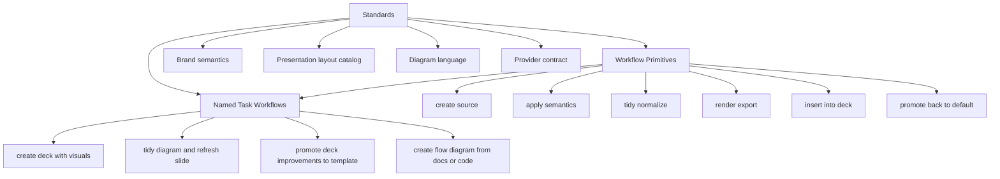
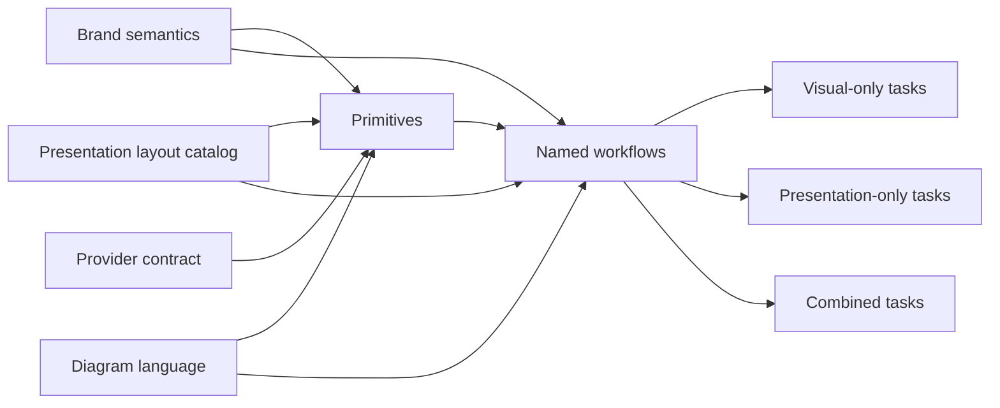
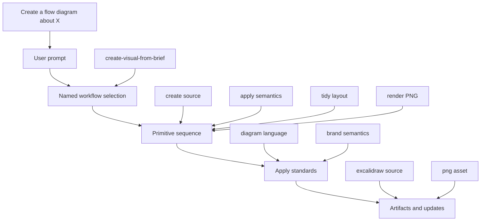
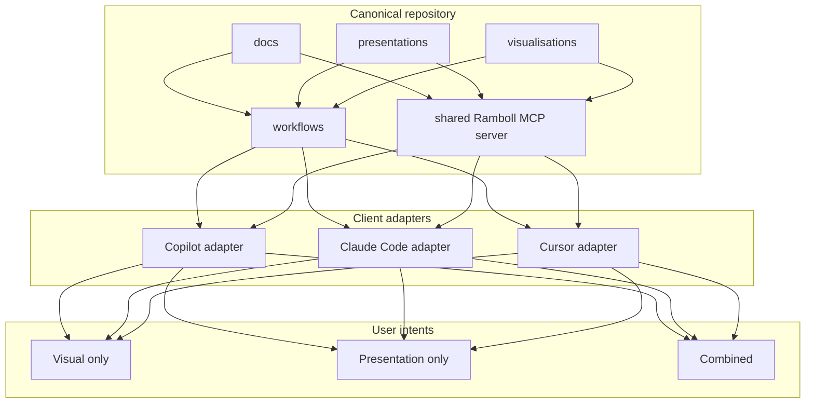

# Conceptual Solution Draft

## Purpose

This document is not the implementation plan yet.

It is a structured conceptual draft that aligns the repository model, the
workflow model, and the client adapter model before implementation begins.

The target outcome is a Ramboll-specific wrapper around multiple presentation
and visualisation tools that can be used through:

- passive repository discovery by any capable agent
- GitHub Copilot in VS Code
- Claude Code
- Cursor
- local and future remote MCP-based tool invocation

The system must support three user intents:

- visualisations only
- presentations only
- combined presentation plus visualisation workflows

It must also remain extensible for future providers such as draw.io and
matplotlib.

## Main Conclusions

| Topic | Conclusion |
| --- | --- |
| Shared MCP server | Yes. One shared Ramboll MCP server implementation should back all clients. |
| Same MCP config for all clients | No. The server implementation and tool contracts can be shared, but the configuration format and lifecycle handling are client-specific. |
| Local background execution | Yes. GitHub Copilot in VS Code, Cursor, and Claude Code all support running local stdio MCP servers from configuration and exposing them to agents. |
| Repo structure by client | Not as the main structure. Keep canonical resources grouped by responsibility, then add a thin `adapters/` or `clients/` layer for client-specific files. |
| User-facing workflow design | Use both stable primitives and named task workflows. Do not rely only on tiny primitives, and do not rely only on giant end-to-end flows. |

## What Is Verified About MCP Client Behavior

### Shared answer

All three target clients can run local MCP servers and expose them to their
agents locally.

### GitHub Copilot in VS Code

Confirmed from VS Code documentation:

- workspace-level MCP configuration lives in `.vscode/mcp.json`
- local MCP servers are started from that configuration
- once trusted and started, their tools become available in chat
- VS Code manages start, stop, restart, logs, enable, disable, and trust
- VS Code can automatically restart MCP servers when config changes

### Cursor

Confirmed from Cursor documentation snippets:

- Cursor supports MCP in both editor and CLI
- Cursor Agent automatically discovers and uses configured MCP tools when
	relevant
- Cursor supports stdio local command-line MCP servers from `mcp.json`
- the CLI uses the same MCP configuration as the editor

### Claude Code

Confirmed from Claude Code documentation snippets:

- Claude Code supports local stdio MCP servers
- project-shared MCP configuration can live in `.mcp.json`
- plugin-provided MCP servers start automatically when the plugin is enabled
- user or project-scoped MCP servers are managed through `claude mcp ...`
	commands and surfaced via `/mcp`
- Claude Code reconnects remote servers automatically; stdio servers are local
	processes and are started as configured

### Practical implication

The same MCP server binary or script can be reused across clients, but you
should expect per-client registration files.

## Recommended Repository Shape

### Recommendation

Do not structure the repository primarily as:

- Copilot
- Claude Code
- Cursor

That would make the client surface the main architecture, even though the real
system is Ramboll standards plus provider capabilities plus workflows.

Instead, keep the main repository shaped around the canonical domain model, and
add a thin adapter layer for each client.

### Why not client-first as the main structure

| Risk | Why it matters |
| --- | --- |
| Duplicated logic | The same workflow semantics get repeated across clients. |
| Drift | Claude, Copilot, and Cursor wrappers gradually stop meaning the same thing. |
| Harder provider growth | Adding draw.io or matplotlib would force edits across multiple client trees instead of one capability model. |
| Worse passive discovery | Agents opening the repo would see client packaging before they see the system architecture. |
| Worse human navigation | Humans looking for the authoritative slide or diagram rules would have to guess which client folder reflects the truth. |

### Better shape

```text
docs/                    # Canonical standards and architecture
presentations/           # Presentation capability layer
visualisations/          # Visual provider capability layer
workflows/               # User-facing task recipes
adapters/                # Thin client-specific wrappers
	copilot/
	claude-code/
	cursor/
servers/
	ramboll-mcp/           # Shared MCP server implementation
```

### Role of `adapters/`

The adapter layer should contain only client-specific integration assets such
as:

- MCP registration examples or install docs
- custom agents
- skills or prompts when client-specific formatting is needed
- plugin manifests if later required
- minimal client-specific routing guidance

It should not own:

- brand rules
- slide layout rules
- diagram semantics
- provider logic
- workflow semantics

## Architecture Layers

The conceptual model should use three layers.



## How The Levels And Core Concepts Relate

These are not orthogonal. They are connected.

The three levels describe how the system operates.

The core concepts describe what the system is about.

### Mapping table

| Core concept | Primary layer | Why |
| --- | --- | --- |
| Brand semantics | Standards | Canonical Ramboll visual and presentation rules. |
| Presentation layout catalog | Standards | Canonical slide structure vocabulary. |
| Diagram language | Standards | Canonical meaning and appearance of diagram elements. |
| Provider adapters | Standards plus primitives | The provider contract is standardised, while the provider executes primitives such as create, tidy, and render. |

### Expanded relationship

| Layer | What it contains | Which core concepts feed it |
| --- | --- | --- |
| Standards | Rules, semantics, catalogs, contracts | Brand semantics, presentation layout catalog, diagram language, provider contract |
| Stable workflow primitives | Reusable operations with explicit input and output | Provider adapters execute these against standards |
| Named task workflows | User-facing recipes composed from primitives | They consume all standards and call the primitives in a specific order |

### Another way to view it



## Canonical Standards Model

### 1. Brand semantics

This is the source of truth for Ramboll-wide visual behavior.

Examples:

- fonts
- color palette and semantic meanings
- logo placement
- title behavior
- footer behavior
- spacing system
- icon rules
- allowed visual hierarchy patterns

### 2. Presentation layout catalog

This is the source of truth for slide structures.

Initial catalog:

| Layout id | Purpose |
| --- | --- |
| `title-default` | Standard Ramboll title slide |
| `content-default` | Generic content slide |
| `split-horizontal` | Side-by-side slide with configurable left-right proportions |
| `split-vertical` | Top-bottom slide with configurable top-bottom proportions |
| `visual-only` | Full visual emphasis |
| `comparison` | Structured comparison content |
| `process` | Process or phased communication slide |
| `closing` | Final or summary slide |

The catalog should define layout families and slot semantics, not freeze every
ratio as a separate canonical layout.

Examples:

- `split-horizontal` with `ratio = 50:50`
- `split-horizontal` with `ratio = 75:25`
- `split-horizontal` with `ratio = 25:75`
- `split-vertical` with `ratio = 60:40`

That means the agent or tool can infer a ratio from the user request and the
content context, while still grounding the decision in a stable layout family.
Named presets may still exist for common cases, but they should be aliases or
defaults, not the only allowed forms.

### 3. Diagram language

This is the source of truth for diagram semantics and geometry conventions.

Examples:

- process step shape
- decision shape
- system boundary shape
- datastore shape
- service shape
- connector types
- arrow direction rules
- orthogonal versus freeform line rules
- label placement rules
- alignment rules
- padding rules
- text fit rules

### 4. Provider contract

Each visual provider should implement the same conceptual lifecycle.

| Stage | Meaning |
| --- | --- |
| Create source | Generate or edit a provider-native source file |
| Apply Ramboll semantics | Map canonical standards into provider-native styling |
| Normalize and tidy | Clean geometry and layout according to rules |
| Render and export | Produce slide-ready or reusable artifacts |

That works for Excalidraw now and for draw.io or matplotlib later.

## Stable Workflow Primitives

These are not primarily user-facing names. They are the stable operations that
named workflows and agents can rely on.

### Why primitives exist

- to make combined workflows composable
- to keep tool contracts small and stable
- to let different clients call the same conceptual operations
- to prevent every end-to-end workflow from re-implementing the same logic

### Primitive catalog draft

| Primitive | Inputs | Outputs | Notes |
| --- | --- | --- | --- |
| `create_deck_source` | title, deck brief, template id | deck source file | Presentation primitive |
| `apply_deck_theme` | deck source, theme id | updated deck source | Presentation primitive |
| `apply_slide_layout` | deck source, slide id, layout id, layout parameters | updated deck source | Uses layout catalog plus layout parameters such as ratio, slot emphasis, and notes behavior |
| `draft_slide_content` | brief, context docs, target slides | structured slide draft | Content primitive |
| `update_slide_content` | deck source, slide id, content patch or instruction | updated deck source | Updates bullets, body copy, callouts, and structured content blocks |
| `update_slide_notes` | deck source, slide id, notes or comments patch | updated deck source | Updates speaker notes, export-facing notes, or review comments |
| `create_visual_source` | provider, visual type, source context | provider source file | Visual primitive |
| `apply_visual_semantics` | provider source, style rules | updated source | Maps Ramboll rules into provider form |
| `tidy_visual_layout` | provider source, diagram rules | normalized source | Critical quality primitive |
| `render_visual_asset` | provider source, target format | PNG, SVG, other asset | Render primitive |
| `insert_visual_into_deck` | deck, slide id, asset, layout slot | updated deck source | Combined primitive |
| `update_deck_structure` | deck source, section or slide change instruction | updated deck source | Adds, removes, reorders, or retitles slides and sections |
| `refresh_visual_asset` | provider source | updated asset set | Convenience primitive built on tidy plus render |
| `diff_deck_vs_template` | deck, template | diff artifact | Governance primitive |
| `promote_deck_changes_to_template` | approved diff | updated shared template | Governance primitive |
| `promote_visual_rules_to_provider_default` | approved source rules | updated provider defaults | Governance primitive |

### Important clarification on `create_visual_source`

The primitive `create_visual_source` is not the main user-facing phrase.

A user would usually say something like:

- create a flow diagram about our ingestion pipeline based on this documentation
- create a sequence diagram for the API call path from this code
- make an architecture diagram of the backend services based on these notes

The system or agent then maps that user request to primitive inputs such as:

| User request part | Primitive input |
| --- | --- |
| flow diagram | `visual type = flow` |
| based on this documentation | `source context = docs` |
| use Excalidraw | `provider = excalidraw` |

So primitives are the operational backend contract, not necessarily the wording
the user sees.

## Named Task Workflows

These are the user-facing workflows that agents should expose, select, and
compose.

### Design rule

If a task is common, brand-sensitive, or easy for agents to do inconsistently,
it should exist as a named workflow.

### A. Governance and standards workflows

| Workflow | Uses which primitives | Depends on which standards |
| --- | --- | --- |
| `diff-template-against-deck` | `diff_deck_vs_template` | Brand semantics, presentation layout catalog |
| `promote-deck-changes-to-template` | `diff_deck_vs_template`, `promote_deck_changes_to_template` | Brand semantics, presentation layout catalog |
| `promote-visual-style-to-provider-default` | `promote_visual_rules_to_provider_default` | Brand semantics, diagram language, provider contract |
| `update-layout-catalog` | catalog maintenance operation | Presentation layout catalog |
| `update-diagram-language` | standards maintenance operation | Diagram language |

### B. Visual workflows

| Workflow | Uses which primitives | Depends on which standards |
| --- | --- | --- |
| `create-visual-from-brief` | `create_visual_source`, `apply_visual_semantics`, optional `tidy_visual_layout`, `render_visual_asset` | Diagram language, brand semantics, provider contract |
| `apply-visual-brand-rules` | `apply_visual_semantics` | Brand semantics, diagram language |
| `tidy-visual-layout` | `tidy_visual_layout` | Diagram language, brand semantics |
| `render-visual-asset` | `render_visual_asset` | Provider contract |
| `refresh-visual-asset` | `tidy_visual_layout`, `render_visual_asset` | Diagram language, brand semantics, provider contract |

### C. Presentation workflows

| Workflow | Uses which primitives | Depends on which standards |
| --- | --- | --- |
| `create-ramboll-deck` | `create_deck_source`, `apply_deck_theme` | Brand semantics, presentation layout catalog |
| `update-ramboll-deck` | `update_deck_structure`, `update_slide_content`, `update_slide_notes`, optional `apply_slide_layout` | Brand semantics, presentation layout catalog |
| `update-ramboll-slide` | `update_slide_content`, `update_slide_notes`, optional `apply_slide_layout` | Brand semantics, presentation layout catalog |
| `apply-ramboll-theme-to-deck` | `apply_deck_theme` | Brand semantics |
| `apply-slide-layout` | `apply_slide_layout` | Presentation layout catalog |
| `generate-slide-content-from-brief` | `draft_slide_content` | Brand semantics, layout catalog |
| `create-or-update-default-layout` | template maintenance primitives | Presentation layout catalog, brand semantics |

### D. Combined workflows

| Workflow | Uses which primitives | Depends on which standards |
| --- | --- | --- |
| `create-visual-and-insert-into-deck` | `create_visual_source`, `apply_visual_semantics`, `tidy_visual_layout`, `render_visual_asset`, `insert_visual_into_deck` | All relevant standards |
| `create-deck-with-supporting-visuals` | deck, content, visual, insert primitives | All relevant standards |
| `update-deck-with-visuals` | `update_deck_structure`, `update_slide_content`, `update_slide_notes`, `apply_slide_layout`, optional `create_visual_source`, `render_visual_asset`, `insert_visual_into_deck` | All relevant standards |
| `insert-or-replace-visual-in-deck` | `render_visual_asset`, `insert_visual_into_deck`, optional `apply_slide_layout` | All relevant standards |
| `refresh-deck-visual` | `tidy_visual_layout`, `render_visual_asset`, `insert_visual_into_deck` if needed | Diagram language, layout catalog |
| `update-section-and-regenerate-visuals` | content plus visual refresh primitives | All relevant standards |

`create-deck-with-supporting-visuals` should be treated as a creation workflow,
not as the umbrella for every later deck edit. Once a deck exists, update
operations should route to explicit update workflows so the intent stays clear.

## Mapping User Intents To Workflows

### Visuals only

| User prompt example | Likely named workflow |
| --- | --- |
| Create a flow diagram about the ingestion pipeline based on this documentation. | `create-visual-from-brief` |
| Tidy up this flow chart and re-export it to PNG. | `refresh-visual-asset` |
| Apply Ramboll styling to this draw.io source. | `apply-visual-brand-rules` |

### Presentations only

| User prompt example | Likely named workflow |
| --- | --- |
| Create a new Ramboll slide deck and suggest a title based on this project brief. | `create-ramboll-deck` |
| Update slide 3 to use a horizontal split with bullets on the left and image on the right, with the text area taking about 70 percent. | `update-ramboll-slide` |
| Change the bullets on slide 4 and add speaker notes for HTML export and browser review. | `update-ramboll-slide` |
| Turn my improvements in this deck into the new default template. | `promote-deck-changes-to-template` |

### Combined

| User prompt example | Likely named workflow |
| --- | --- |
| Create a new Ramboll slide deck and add two slides with diagrams based on this documentation. | `create-deck-with-supporting-visuals` |
| Insert this architecture diagram into slide 5 and rebalance the slide so the visual gets most of the space. | `insert-or-replace-visual-in-deck` |
| Tidy up the flow chart on slide 5 and re-export it. | `refresh-deck-visual` |
| Update section 2 and regenerate the related visual assets. | `update-section-and-regenerate-visuals` |

## How A User Should Talk To The System

The user should usually talk in task language, not primitive language.

### Good user-facing phrasing

- create a flow diagram about X based on this documentation
- create a sequence diagram from this code path
- create a new Ramboll deck about X
- update slide 2 so it becomes a horizontal split with text emphasis
- add speaker notes to slide 4 for HTML export review
- insert this visual into slide 5 and rebalance the layout
- tidy the diagram on slide 5 and re-export it
- turn these deck improvements into the new default layout

### Optional advanced phrasing

Advanced users may optionally specify provider or layout details.

- create a flow diagram in Excalidraw about X based on this documentation
- create a draw.io architecture diagram from these notes
- create slide 4 using the visual-only layout
- make slide 2 use `split-horizontal` with ratio `27:25`

### Internal mapping model



## Recommendation On Client Adapter Placement

### Recommended pattern

Use a dedicated adapter area, not a client-first repository.

Suggested shape:

```text
adapters/
	copilot/
		README.md
		agents/
		skills/
		mcp/
	claude-code/
		README.md
		agents/
		skills/
		mcp/
	cursor/
		README.md
		rules/
		commands/
		mcp/
```

### Purpose of this pattern

| Need | How this pattern helps |
| --- | --- |
| Humans need clarity | They can find one client-specific entrypoint without mistaking it for the canonical architecture. |
| Agents need clarity | Passive repo search still finds canonical docs first, while adapter files clearly indicate client-specific usage. |
| Shared truth must stay centralized | Adapter files can point back to `docs/`, `workflows/`, `presentations/`, and `visualisations/`. |
| Future clients may be added | A new adapter can be added without reshaping the whole repo. |

### Important guardrail

Adapter files should mostly reference shared resources instead of copying them.

## Draft Conceptual Flow For The Whole System



## What To Focus On First

The highest-value first-class workflows should be the ones that reflect actual
pain already observed.

### Priority 1

| Priority | Workflow | Why first |
| --- | --- | --- |
| 1 | `create-ramboll-deck` | This is a core entry workflow. |
| 1 | `update-ramboll-slide` | This is a common day-two workflow for changing bullets, notes, layout, and inserted visuals. |
| 1 | `apply-slide-layout` | You already discovered the need for more split layout control. |
| 1 | `create-visual-from-brief` | This is the core value for provider-backed diagrams. |
| 1 | `tidy-visual-layout` | This directly addresses the manual cleanup pain you observed. |
| 1 | `refresh-deck-visual` | This matches a natural maintenance prompt. |

### Priority 2

| Priority | Workflow | Why next |
| --- | --- | --- |
| 2 | `create-deck-with-supporting-visuals` | High value combined workflow once the underlying parts are stable. |
| 2 | `promote-deck-changes-to-template` | Needed to avoid layout improvements staying stuck in one deck. |
| 2 | `promote-visual-style-to-provider-default` | Needed to avoid diagram rules drifting. |

### Priority 3

| Priority | Workflow | Why later |
| --- | --- | --- |
| 3 | provider expansion to draw.io | Do this after the provider contract is proven with Excalidraw. |
| 3 | provider expansion to matplotlib | Do this after non-diagram providers are conceptually fitted into the same lifecycle. |

## Proposed Next Iteration

The next conceptual step should be to define the first stable workflow and tool
contract set, not implementation details yet.

Recommended next document or next revision topics:

1. Draft the first MCP tool contract for the Priority 1 workflows.
2. Draft the canonical standards documents that are still missing:
	 brand semantics, slide layout catalog, diagram language, provider contract.
3. Draft the client adapter policy: what belongs in `adapters/` and what must
	 stay canonical.

## First MCP Tool Contract Draft

This section turns the conceptual workflow model into a first presentation-
facing MCP tool shape.

The design choices are:

- separate creation tools from update tools
- model slide layout as a typed parameter object, not a list of hardcoded ratio-
	specific tool names
- carry notes and comments as explicit structured slide fields so HTML export
	and browser review can use them predictably

### Tool set overview

| Tool name | Primary use | Why it exists separately |
| --- | --- | --- |
| `create_ramboll_deck` | Create a new deck | Creation has different inputs and validations than update work |
| `update_ramboll_deck` | Update multiple slides or deck structure in one request | Deck-wide edits should not be overloaded into create |
| `update_ramboll_slide` | Update one slide's content, layout, notes, or visuals | Common day-two operation with a tighter scope |
| `apply_slide_layout` | Apply or adjust a layout using typed parameters | Keeps layout control reusable and parameterized |

### 1. `create_ramboll_deck`

Purpose:

- create a new deck source from a Ramboll template
- optionally seed slides from a brief
- optionally prepare export targets

Suggested input contract:

```json
{
	"title": "string",
	"deckBrief": "string",
	"outputPath": "string",
	"templateId": "ramboll-default",
	"themeId": "ramboll-default",
	"initialSlides": [
		{
			"title": "string",
			"body": ["string"],
			"layout": {
				"layoutId": "content-default"
			},
			"notes": {
				"speakerNotes": "string",
				"reviewComments": ["string"],
				"htmlExportMode": "speaker-notes"
			}
		}
	],
	"export": {
		"html": true,
		"includeSpeakerNotes": true
	}
}
```

Suggested output contract:

```json
{
	"deckPath": "string",
	"slideCount": 3,
	"createdSlides": ["slide-1", "slide-2", "slide-3"],
	"exportArtifacts": [
		{
			"format": "html",
			"path": "string"
		}
	]
}
```

### 2. `update_ramboll_deck`

Purpose:

- handle deck-wide and multi-slide updates after the deck already exists
- support add, remove, reorder, retitle, content update, layout update, notes
	update, and visual insertion in one request

Suggested input contract:

```json
{
	"deckPath": "string",
	"operations": [
		{
			"type": "update-slide",
			"slideRef": "slide-3",
			"changes": {
				"title": "Updated title",
				"body": ["Updated bullet 1", "Updated bullet 2"],
				"notes": {
					"speakerNotes": "Talk through the architecture tradeoffs.",
					"reviewComments": ["Check whether the API name changed."],
					"htmlExportMode": "speaker-notes"
				}
			}
		},
		{
			"type": "apply-layout",
			"slideRef": "slide-3",
			"layout": {
				"layoutId": "split-horizontal",
				"orientation": "horizontal",
				"ratio": {
					"left": 70,
					"right": 30
				},
				"slotEmphasis": "text",
				"visualSlot": "right"
			}
		},
		{
			"type": "insert-visual",
			"slideRef": "slide-3",
			"assetPath": "string",
			"targetSlot": "right"
		}
	],
	"export": {
		"html": true,
		"includeSpeakerNotes": true
	}
}
```

Suggested output contract:

```json
{
	"deckPath": "string",
	"updatedSlides": ["slide-3"],
	"appliedOperations": 3,
	"exportArtifacts": [
		{
			"format": "html",
			"path": "string"
		}
	]
}
```

### 3. `update_ramboll_slide`

Purpose:

- give the agent a narrow tool for the most common edit pattern
- avoid forcing a one-slide request into a deck-wide batch contract

Suggested input contract:

```json
{
	"deckPath": "string",
	"slideRef": "slide-4",
	"title": "string",
	"body": ["string"],
	"layout": {
		"layoutId": "split-horizontal",
		"orientation": "horizontal",
		"ratio": {
			"left": 60,
			"right": 40
		},
		"slotEmphasis": "visual"
	},
	"notes": {
		"speakerNotes": "Explain why this change matters.",
		"reviewComments": ["Confirm wording with stakeholders."],
		"htmlExportMode": "speaker-notes"
	},
	"visual": {
		"action": "replace",
		"assetPath": "string",
		"targetSlot": "right"
	},
	"export": {
		"html": true,
		"includeSpeakerNotes": true
	}
}
```

### 4. `apply_slide_layout`

Purpose:

- keep layout application reusable across create and update flows
- encode layout as a typed object that can be inferred from user intent

Suggested input contract:

```json
{
	"deckPath": "string",
	"slideRef": "slide-2",
	"layout": {
		"layoutId": "split-horizontal",
		"orientation": "horizontal",
		"ratio": {
			"left": 27,
			"right": 25
		},
		"slotAssignments": {
			"left": "body",
			"right": "visual"
		},
		"slotEmphasis": "text",
		"alignment": "top",
		"preserveExistingContent": true
	}
}
```

### Typed layout parameter model

The important point is that `layoutId` identifies the structural family, while
the layout object carries the variable geometry and intent.

Suggested fields:

| Field | Type | Meaning |
| --- | --- | --- |
| `layoutId` | string | Canonical layout family such as `content-default`, `split-horizontal`, `split-vertical`, `visual-only` |
| `orientation` | enum | `horizontal` or `vertical` when relevant |
| `ratio` | object | Relative size split between slots |
| `slotAssignments` | object | Maps content roles such as `body`, `visual`, `notes-panel` into layout slots |
| `slotEmphasis` | enum | `text`, `visual`, or `balanced` |
| `alignment` | enum | High-level alignment intent such as `top`, `center`, `distributed` |
| `preserveExistingContent` | boolean | Controls whether layouting may restructure current content blocks |

The ratio values should be interpreted as relative weights, not as a finite
enum catalog. That lets the agent choose `50:50`, `70:30`, or `27:25` when the
user request or content suggests it.

### Notes and comments model

Speaker notes and review comments should be explicit slide data, not hidden in
freeform body text.

Suggested notes object:

```json
{
	"notes": {
		"speakerNotes": "string",
		"reviewComments": ["string"],
		"htmlExportMode": "hidden | speaker-notes | review-pane"
	}
}
```

Meaning:

- `speakerNotes` is presenter-facing guidance
- `reviewComments` is reviewer-facing commentary that should stay distinct from
	the visible slide body
- `htmlExportMode` controls how notes appear when exported to HTML and reviewed
	in the browser

This matters because a user request like "change comments" or "add speaker
notes for browser review" should map to a clear structured field, not to an
ambiguous content patch.

### Routing guidance for agents

| User intent | Preferred tool |
| --- | --- |
| Create a new deck | `create_ramboll_deck` |
| Update one slide's bullets, layout, notes, or inserted visual | `update_ramboll_slide` |
| Update several slides or deck structure at once | `update_ramboll_deck` |
| Rebalance an existing slide without otherwise editing content | `apply_slide_layout` |

### Why this contract shape is preferable

- It keeps create and update semantics separate, which reduces ambiguous tool
	selection.
- It lets layout stay canonical at the family level while remaining flexible in
	actual proportions.
- It gives speaker notes and review comments a first-class place in the model,
	which is necessary for HTML export and browser-based review flows.

