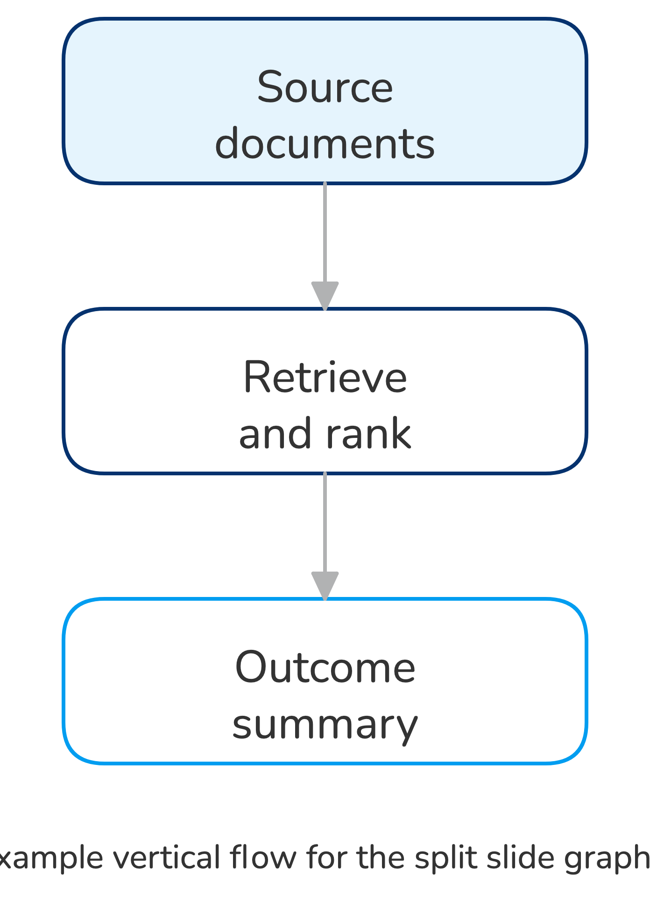
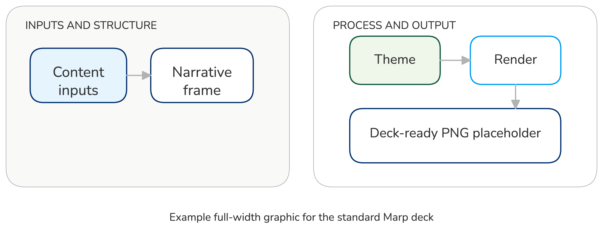

<!-- _class: lead -->

# Example Deck With Split And Full Visuals

- This deck demonstrates the two main visual patterns in the Ramboll default
  deck
- Both graphics are produced from source in `visualisations/excalidraw/`

---
<!-- _class: image-right -->

# Split Layout With Diagram

- Use the left column for the narrative or takeaway
- Use the right column for the rendered supporting diagram
- Keep the graphic sourced from `visualisations/`, not hand-drawn in the deck

---
<!-- _class: full-image -->

# Full-Image Visual

